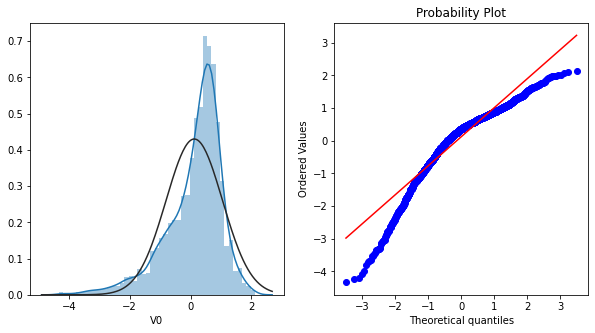
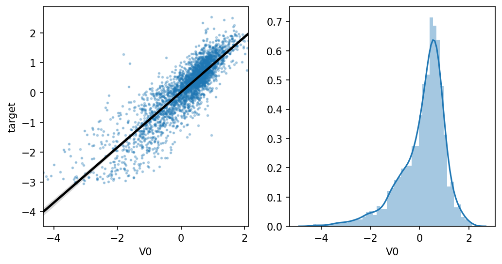
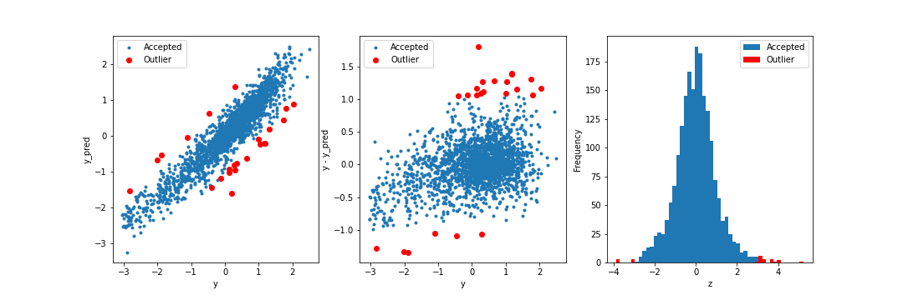

# 阿里云天池大赛 赛题解析

专业术语：

- `Boosting`
  是一族可将弱学习器提升为强学习器的算法，属于集成学习（ensemble learning）的范畴。Boosting 方法基于这样一种思想：对于一个复杂任务来说，将多个专家的判断进行适当的综合所得出的判断，要比其中任何一个专家单独的判断要好。通俗地说，就是"三个臭皮匠顶个诸葛亮"的道理。

## 1 数据探索（EDA）

### 1.1 变量识别

- 输入/输出变量
- 数据类型
- 连续型变量和类别型变量

### 1.2 变量分析

- 单变量分析：
  - 连续性变量：数据的中心分布趋势和变量的分布
    - 直方图
    - `sns.boxplot(train_data['V0'],orient="v", width=0.5)`
    - Q-Q图：数据的分位数和正态分布分位数对比参照图，如果符合正态分布，则所有点落在直线上
    - KDE: 核密度估计，用于对比训练集和测试集特征分布情况
  - 类比变量：频率及其分布

- 双变量分析：
  - 连续型和连续型：
    - 绘制散点图
    - 计算相关性`np.corrcoef(X, Y)`
    - 线性回归关系图
  - 类别型和类别型：
    双向表；叠状柱形图；`卡方检验`（比较理论频率与实际频率的拟合优度）
  - 类别型和类别型：
    绘制小提琴图

```python
# 直方图和Q-Q图
plt.figure(figsize=(10,5))

ax = plt.subplot(1,2,1)
sns.distplot(train_data['V0'], fit=stats.norm)
ax = plt.subplot(1,2,2)
res = stats.probplot(train_data['V0'], plot=plt)

# KDE
plt.figure(figsize=(8,4), dpi=150)
ax = sns.kdeplot(train_data['V0'], color="Red", shade=True)
ax = sns.kdeplot(test_data['V0'], color="Blue", shade=True)
ax.set_xlabel('V0')
ax.set_ylabel("Frequency")
ax = ax.legend(["train","test"])

# 线性回归关系图
ax=plt.subplot(1,2,1)
sns.regplot(x='V0', y='target', data=train_data, ax=ax, 
            scatter_kws={'marker':'.','s':3,'alpha':0.3},
            line_kws={'color':'k'});
plt.xlabel('V0')
plt.ylabel('target')

ax=plt.subplot(1,2,2)
sns.distplot(train_data['V0'].dropna())
plt.xlabel('V0')

plt.show()

# 相关关系热力图
pd.set_option('display.max_columns', 10)
pd.set_option('display.max_rows', 10)
data_train1 = train_data.drop(['V5', 'V9', 'V11', 'V17', 'V22', 'V28'],axis=1)
train_corr = data_train1.corr()

ax = plt.subplots(figsize=(20, 16))#调整画布大小
ax = sns.heatmap(train_corr, vmax=.8, square=True, annot=True)#画热力图   annot=True 显示系数

## K个最相关的特征
k = 10  
cols = train_corr.nlargest(k, 'target')['target'].index

cm = np.corrcoef(train_data[cols].values.T)
hm = plt.subplots(figsize=(10, 10))
hm = sns.heatmap(train_data[cols].corr(), annot=True, square=True)
plt.show()

# Box-Cox
cols_numeric_left = cols_numeric[0:13]
cols_numeric_right = cols_numeric[13:]
train_data_process = pd.concat([train_data_process, train_data['target']], axis=1)

fcols = 6
frows = len(cols_numeric_left)
plt.figure(figsize=(4 * fcols, 4 * frows))
i = 0

for var in cols_numeric_left:
    dat = train_data_process[[var, 'target']].dropna()

    i += 1
    plt.subplot(frows, fcols, i)
    sns.distplot(dat[var], fit=stats.norm)
    plt.title(var + ' Original')
    plt.xlabel('')

    i += 1
    plt.subplot(frows, fcols, i)
    _ = stats.probplot(dat[var], plot=plt)
    plt.title('skew=' + '{:.4f}'.format(stats.skew(dat[var])))
    plt.xlabel('')
    plt.ylabel('')

    i += 1
    plt.subplot(frows, fcols, i)
    plt.plot(dat[var], dat['target'], '.', alpha=0.5)
    plt.title('corr=' +
              '{:.2f}'.format(np.corrcoef(dat[var], dat['target'])[0][1]))

    i += 1
    plt.subplot(frows, fcols, i)
    trans_var, lambda_var = stats.boxcox(dat[var].dropna() + 1)
    trans_var = scale_minmax(trans_var)
    sns.distplot(trans_var, fit=stats.norm)
    plt.title(var + ' Tramsformed')
    plt.xlabel('')

    i += 1
    plt.subplot(frows, fcols, i)
    _ = stats.probplot(trans_var, plot=plt)
    plt.title('skew=' + '{:.4f}'.format(stats.skew(trans_var)))
    plt.xlabel('')
    plt.ylabel('')

    i += 1
    plt.subplot(frows, fcols, i)
    plt.plot(trans_var, dat['target'], '.', alpha=0.5)
    plt.title('corr=' +
              '{:.2f}'.format(np.corrcoef(trans_var, dat['target'])[0][1]))
```





### 1.3 缺失值处理

- 产生原因：
  - 完全随机丢失
  - 随机丢失
  - 不可预测因子导致的丢失
  - 取决于自身的缺陷

- 处理方法
  - 删除：成行删除，成对删除
  - 填充：均值、模型、中位数
  - 预测模型填充
    - 不足：预测出来的结果更加规范；如果变量之间不存在关系，得到的缺失值会不准确

- 发现缺失数据

### 1.4 异常值处理

- 产生原因
  - 数据输入误差
  - 测量误差
  - 实验误差
  - 有意造成异常值
  - 数据处理误差
  - 采样误差

- 异常值检测
  - 可视化方法：线型图、直方图、散点图

```python
# function to detect outliers based on the predictions of a model
def find_outliers(model, X, y, sigma=3, verbose=True, plot=True):
    # predict y values using model
    try:
        y_pred = pd.Series(model.predict(X), index=y.index)
    # if predicting fails, try fitting the model first
    except:
        model.fit(X,y)
        y_pred = pd.Series(model.predict(X), index=y.index)
        
    # calculate residuals between the model prediction and true y values
    resid = y - y_pred
    mean_resid = resid.mean()
    std_resid = resid.std()

    # calculate z statistic, define outliers to be where |z|>sigma
    z = (resid - mean_resid) / std_resid    
    outliers = z[abs(z) > sigma].index
    
    if verbose:
        # print and plot the results
        print('R2=',model.score(X,y))
        print("mse=",mean_squared_error(y,y_pred))
        print('---------------------------------------')

        print('mean of residuals:',mean_resid)
        print('std of residuals:',std_resid)
        print('---------------------------------------')

        print(len(outliers),'outliers:')
        print(outliers.tolist())

    if plot:
        plt.figure(figsize=(15,5))
        ax_131 = plt.subplot(1,3,1)
        plt.plot(y,y_pred,'.')
        plt.plot(y.loc[outliers],y_pred.loc[outliers],'ro')
        plt.legend(['Accepted','Outlier'])
        plt.xlabel('y')
        plt.ylabel('y_pred');

        ax_132=plt.subplot(1,3,2)
        plt.plot(y,y-y_pred,'.')
        plt.plot(y.loc[outliers],y.loc[outliers]-y_pred.loc[outliers],'ro')
        plt.legend(['Accepted','Outlier'])
        plt.xlabel('y')
        plt.ylabel('y - y_pred');

        ax_133=plt.subplot(1,3,3)
        z.plot.hist(bins=50,ax=ax_133)
        z.loc[outliers].plot.hist(color='r',bins=50,ax=ax_133)
        plt.legend(['Accepted','Outlier'])
        plt.xlabel('z')
        
        plt.savefig('outliers.png')
    
    return outliers


from sklearn.linear_model import Ridge
from sklearn.metrics import mean_squared_error
X_train = train_data.iloc[:,0:-1]
y_train = train_data.iloc[:,-1]
outliers = find_outliers(Ridge(), X_train, y_train)
```



- 异常值的处理方法
  - 删除
  - 转换：如取对数减轻由极值引起的变化
  - 填充：像缺失值一样修改
  - 区别对待：对两组进行建模，然后将两组的输出合并

### 1.5 变量转换

- 目的：一些变量的取值不平均，会对结果造成影响，对其进行转换，使其分布落在合理的区间内
- 方法
  - 对数转换
  - 右倾：取平方根或立方根；左倾：平方或者立方
  - 变量分组
  - Box-Cox
    由于线性回归是基于正态分布的的，因此需要将数据转换时期符合正态分布
    Box-Cox是统计建模常用的一种数据转换方法。这一转换可以是线性回归模型满足线性、正态性、独立性及方差齐性的同时，又不丢失信息
    在做Box-Cox变换之前需要对数据做归归一化处理

```python
cols_numeric_left = cols_numeric[0:13]
cols_numeric_right = cols_numeric[13:]
train_data_process = pd.concat([train_data_process, train_data['target']],
                               axis=1)

fcols = 6
frows = len(cols_numeric_left)
plt.figure(figsize=(4 * fcols, 4 * frows))
i = 0

for var in cols_numeric_left:
    dat = train_data_process[[var, 'target']].dropna()

    i += 1
    plt.subplot(frows, fcols, i)
    sns.distplot(dat[var], fit=stats.norm)
    plt.title(var + ' Original')
    plt.xlabel('')

    i += 1
    plt.subplot(frows, fcols, i)
    _ = stats.probplot(dat[var], plot=plt)
    plt.title('skew=' + '{:.4f}'.format(stats.skew(dat[var])))
    plt.xlabel('')
    plt.ylabel('')

    i += 1
    plt.subplot(frows, fcols, i)
    plt.plot(dat[var], dat['target'], '.', alpha=0.5)
    plt.title('corr={:.2f}'.format(np.corrcoef(dat[var], dat['target'])[0][1]))

    # stats.boxcox
    i += 1
    plt.subplot(frows, fcols, i)
    trans_var, lambda_var = stats.boxcox(dat[var].dropna() + 1)
    trans_var = scale_minmax(trans_var)
    sns.distplot(trans_var, fit=stats.norm)
    plt.title(var + ' Tramsformed')
    plt.xlabel('')

    i += 1
    plt.subplot(frows, fcols, i)
    _ = stats.probplot(trans_var, plot=plt)
    plt.title('skew=' + '{:.4f}'.format(stats.skew(trans_var)))
    plt.xlabel('')
    plt.ylabel('')

    i += 1
    plt.subplot(frows, fcols, i)
    plt.plot(trans_var, dat['target'], '.', alpha=0.5)
    plt.title('corr=' +
              '{:.2f}'.format(np.corrcoef(trans_var, dat['target'])[0][1]))
```

### 1.6 新变量生成

- 目的：新生成的变量肯能和目标变量由更好的相关性，有助于数据的分析
- 方法：
  - 创建派生变量：使用一组函数或者不同的方法从现有的变量创建新的变量
  - 创建哑变量：哑变量可将类别变量转换成数值型变量
    - 注意：类别变量对于逻辑回归、SVM等模型来说，必须经过处理转换成数字型特征才能正确工作
    - 编码方式可为：序号编号、onehot、二进制编码

### 1.7 不均衡样本

- 随机欠采样
  - 再平衡数据量的同时减少了数据量，加速了训练
  - 数据减少会影响模型的特征学习能力和泛化能力
- 随机过采样
  - 从少数样本集中随机重复抽取样本（有放回）以得到更多的样本
  - 没有导致数据的损失
  - 相对于较少的类别复制增加了过拟合的可能性
- 基于聚类的过采样方法
  - 通过聚类作为中介，在一定程度上缓解了类间样本的不平衡问题，同时还缓解了类内的不平衡问题
- SMOTE
  - 采用对少数样本进行人工合成的方式，并将新样本加入训练集中
- 基于数据清洗的SMOTE

### 1.8 数据分布

- 伯努利分布
- 二项分布
- 泊松分布
- 正态分布
- 指数分布

-----

## 2 特征工程

特征工程一般包括特征使用，特征获取、特征处理、特征选择和特征监控。

### 2.1 数据预处理

- 数据采集
- 数据清洗：去除脏数据
- 数据采样：正负样本不均衡
  - 下采样（正样本 > 负样本）
  - 上采样（负样本 > 正样本）

### 2.2 特征处理

SVM、KNN、PCA等模型必须进行归一化或者标准化操作（sklearn.prepoccessing）

- 归一化(`Nomalizer`)： 最大最小值归一化、零均值归一化
  将样本的特征转换到同一量纲下；归一化会改变数据的原始距离、分布和信息，而标准化一般不会
  特点
  - 对输出结果范围有一定的要求
  - 数据较为稳定，不存在极端的最大值和最小值
  - 通过梯度下降求解的模型，一般都需要归一化处理，更容易找到最优解，否则收敛的时间会很长
- 标准化（`StandardScaler`）
  - 数据存在异常值或者较多噪音，通过中心化间接避免异常值的影响
- 区间缩放法(`MinMaxScaler`)- 定量特征二值化(`Binarizer`)
- 定性特征哑编码(`OneHotEncoder`): 将类别变量转换成哑变量的过程
- 缺失值处理(`SimpleImputer`)
- 数据转换
  常见的有基于多项式、指数函数和对数函数的转换
- 高维组合特征的处理
  - 把一阶的离散特征两两组合，构成高阶组合特征
  - SVD(奇异值分解) 类隐向量放大，简单参数，增加参数的迭代拟合数量，防止过拟合
  - 简单将特征两两组合存在参数过多、过拟合的情况 -> 构建决策树进行特征组合

``` python
from sklearn.datasets import load_iris
from numpy import vstack, array, nan, log1p

from sklearn.preprocessing import StandardScaler, MinMaxScaler, Binarizer, Normalizer, OneHotEncoder, FunctionTransformer
from sklearn.impute import SimpleImputer, PolynomialFeatures

iris = load_iris()

#标准化，返回值为标准化后的数据
StandardScaler().fit_transform(iris.data)

#区间缩放，返回值为缩放到[0, 1]区间的数据
MinMaxScaler().fit_transform(iris.data)

#归一化，返回值为归一化后的数据
Normalizer().fit_transform(iris.data)

#二值化，阈值设置为3，返回值为二值化后的数据
Binarizer(threshold=3).fit_transform(iris.data)

#哑编码，对IRIS数据集的目标值，返回值为哑编码后的数据
OneHotEncoder(categories='auto').fit_transform(iris.target.reshape((-1,1)))

#缺失值计算，返回值为计算缺失值后的数据; 参数missing_value为缺失值的表示形式，默认为NaN; 参数strateg默认为mean 
SimpleImputer().fit_transform(vstack((array([nan, nan, nan, nan]), iris.data)))

#多项式转换, 参数degree为度，默认值为2 
PolynomialFeatures().fit_transform(iris.data)

#自定义转换函数为对数函数的数据变换, 第一个参数是单变元函数
FunctionTransformer(log1p, validate=False).fit_transform(iris.data)
```

### 2.3 特征降唯

采用某种映射的方法，将高维空间的数据点映射到低维空间；高维空间包括冗余信息及噪音信息，通过特征降维可以减少冗余信息造成的误差，从而提高模型的精度

#### 特征选择

映射函数直接将不重要的特征删除，不过这样会造成特征数据的丢失。
特征选择的目标：

- 特征是否发散：不发散，如方差为0
- 特征与目标的相关性

方法：

- 过滤法(Filter)
  按照发散性或者相关性对各个特征进行评分，通过设定阈值或者待选择阈值的个数来选择特征
- 包装法(Wrapper)
  通过目标函数（通常是预测效果评分）每次选择/排除若干特征
- 嵌入法(Embbedded)
  使用机器学习的某些算法或者模型进行训练，得到各个特征的权值系数

在Python中的实现(`sklearn.feature_selection`)

- VarianceThreshold(Filter)
- SelectKBest(Filter)，可选择相关系数、卡方检验或者最大信息系数
- RFE(Wrapper)，递归消除特征法
- SelectFromModel(Embbedded)，基于模型的特征选择

``` python

import numpy as np
from minepy import MINE 
from scipy.stats import pearsonr
from sklearn.datasets import load_iris
from sklearn.linear_model import LogisticRegression
from sklearn.ensemble import GradientBoostingClassifier
from sklearn.feature_selection import VarianceThreshold, chi2, SelectKBest, RFE, SelectFromModel

iris = load_iris()

""" Filter """
# 方差选择法，返回值为特征选择后的数据, 参数threshold为方差的阈值
VarianceThreshold(threshold=3).fit_transform(iris.data)

# 相关系数法：选择K个最好的特征，返回选择特征后的数据; 第一个参数为计算评估特征是否好的函数，该函数输入特征矩阵和目标向量，输出二元组（评分，P值）的数组，数组第i项为第i个特征的评分和P值。在此定义为计算相关系数; 参数k为选择的特征个数
SelectKBest(lambda X, Y: np.array(list(map(lambda x: pearsonr(x, Y), X.T))).T[0], k=2)\
    .fit_transform(iris.data, iris.target)

# 卡方检验：选择K个最好的特征，返回选择特征后的数据
SelectKBest(chi2, k=2).fit_transform(iris.data, iris.target)
 
# 最大信息系数法：由于MINE的设计不是函数式的，定义mic方法将其为函数式的，返回一个二元组，二元组的第2项设置成固定的P值0.5 
def mic(x, y): 
    m = MINE() 
    m.compute_score(x, y) 
    return (m.mic(), 0.5) 

SelectKBest(lambda X, Y: np.array(list(map(lambda x: mic(x, Y), X.T))).T[0], k=2)\
    .fit_transform(iris.data, iris.target)

""" Wrapper """
#递归特征消除法，返回特征选择后的数据; 参数estimator为基模型, 参数n_features_to_select为选择的特征个数
RFE(estimator=LogisticRegression(multi_class='auto', solver='lbfgs', max_iter=500), n_features_to_select=2)\
    .fit_transform(iris.data, iris.target)

""" Embbedded """
#带L1惩罚项的逻辑回归作为基模型的特征选择
SelectFromModel(LogisticRegression(penalty='l2', C=0.1, solver='lbfgs', multi_class='auto'))\
    .fit_transform(iris.data, iris.target)
 
# GBDT作为基模型的特征选择
SelectFromModel(GradientBoostingClassifier()).fit_transform(iris.data, iris.target)

```

#### 线性降维

- 主成分分析法(`sklearn.decomposition.PCA`)
- 线形判别分析法

``` python
from sklearn.datasets import load_iris
from sklearn.decomposition import PCA
from sklearn.discriminant_analysis import LinearDiscriminantAnalysis as LDA

iris = load_iris()

#主成分分析法，返回降维后的数据, 参数n_components为主成分数目
PCA(n_components=2).fit_transform(iris.data)
 
#线性判别分析法，返回降维后的数据, 参数n_components为降维后的维数
LDA(n_components=2).fit_transform(iris.data, iris.target)
```

-----

## 3 模型训练

### 3.1 回归的概念

用于目标数量连续时预测所需目标数量的值

### 3.2 回归模型训练和预测

| 模型 |优点|缺点|使用技巧|
|--|--|--|--|
| 线性回归模型 | 模型简单，部署方便，回归权重可用于结果分析；训练快 | 精度低，特征存在一定的共线性问题 | 需要归一化处理，建议进行一定的特征处理 |
| K近邻回归   | 模型简单，易于理解，对于数据量小的情况方便快捷，可视化方便 | 计算量大，不合适数据量大的情况；需要调参数|特征需要归一化，重要的权重可以适当加一定比例的权重|
| 决策树回归  |  | | |
| 随机森林回归 | 使用方便，特征无需做过多变换；精度较高；模型并行化训练快 | 结果不易解析 | 参数调节，提高精度 |
| LightGBM | 精度高 | 训练时间长，模型复杂 | 有效的验证防止过拟合；参数搜索 |

模型基本用法

```python
from sklearn.linear_model import LinearRegression
from sklearn.neighbors import KNeighborsRegressor
from sklearn.tree import DecisionTreeRegressor
from sklearn.ensemble import RandomForestRegressor
from sklearn.metrics import mean_squared_error  #评价指标

# 线性回归模型算法
clf = LinearRegression()
clf.fit(train_data, train_target)

# K近邻回归模型算法
clf = KNeighborsRegressor(n_neighbors=3)
clf.fit(train_data, train_target)

# 决策回归树模型算法
clf = DecisionTreeRegressor()
clf.fit(train_data, train_target)

# 随机森林回归树模型算法
clf = RandomForestRegressor(n_estimators=200)
clf.fit(train_data, train_target)

test_pred = clf.predict(test_data)
score = mean_squared_error(test_target, clf.predict(test_data))
```

-----

## 4 模型验证

### 4.1 模型评估的概念和方法

#### 欠拟合和过拟合


|  | 定义 | 改进方法 |
|--|--|--|--|
| 欠拟合 | 高偏差；算法训练的模型不能很好的表达数据关系 | 1. 选择一个带有更多参数、更强大的模型；2. 增加额外特征; 3. 减少模型的约束|
| 过拟合 | 高方差；算法训练的模型过多地表达了数据关系，此时很有肯能过多表达噪音数据 | 1. 收集更多数据；2. 简化模型, 降低模型复杂度；3. 减少训练数据的噪音（修复数据错误，消除异常值）；4. 减少特征数量；5. 正则化（通过约束模型使其更简单，并降低过拟合的风险）； 6. 使用集成学习 |

模型的泛化误差可以表示为三个截然不同的误差之和：

- 偏差
  在于错误的假设，比如数据是线形的，而实际上是二次的；高偏差模型最有可能对训练数据拟合不足
- 方差
  模型对训练数据饿微小变化过度敏感导致的；具有高自由度的模型很有坑也有高偏差
- 不可避免的误差
  数据噪音所致；唯一方法是清楚数据噪音（修复数据源、减产并移除异常值）

增加模型的复杂度通常会显著提神模型的方差，降低偏差；降低模型的复杂度会提升模型的偏差，降低方差

#### 泛化和正则化

- 泛化
  指机器学习模型学习到的概念在处理训练未遇到的样本的表现，即模型处理新样本的能力
- 正则化
  给需要训练的目标函数加上一些规则（限制），目的是防止过拟合

- 岭回归（对参数空间进行L2范式正则化）
- LASSO回归（对参数空间进行L1范式正则化）

早期停止法

- 一种正则化方法，在验证误差到达最小值时停止训练

#### 评价指标和调用方法

回归问题

- MAE(平均绝对误差)
- MSE(均方误差)
- RMSE(均方根误差)
  易受异常值的影响
- MAPE（平均百分比误差）
  比RMSE更具鲁棒性，相当于把每个点的误差进行了归一化，降低了个体离群点带来的绝对误差的影响
- R-squared(R平方值)

分类问题

- 准确率
- 精确率与召回率（P和R曲线）
  - 精确率 = `分类正确的正样本数量` / `分类器判定的正样本个数`
  - 召回率 = `分类正确的正样本数量` / `真正的正样本个数`
- ROC(Reciever Operating Characteristics Cureve)
  评估`二值分类器`最重要的指标，相对于`P-R曲线`，但正负样本发生变化的时候，ROC一般可以保持不变，有利于评估正负样本不均衡的情况
  横轴：假阳性率
  纵轴：真阳性率
- AUC：ROC曲线下的面积大小
  - AUC值越大，说明分类器越可能把正样本排在前面，分类的效果更好  

距离

- 欧拉距离
  - 体现数值上的绝对差异
- 余弦距离 = 1 - 余弦相似度
  - 体现数值上的相对差异

#### 模型评估方法

- Holdout检验
  将原始的样本随机分为测试集和验证集
- 自助法
  针对小样本，进行随机有放回的抽样
- 交叉验证(Cross Validation)

|  |描述|调用|
|--|--|--|
| 简单交叉验证  |  |  |
| K折交叉验证   |  |  |
| 留一法交叉验证 |  |  |
| 留P法交叉验证  |  |  |

```python
from sklearn.model_selection import Kfold 
kf = KFold(n_splits=10)
```

### 4.2 模型调参

- 目标
  对模型的参数进行调整，以找到使模型性能最优的参数；使得整体模型的偏差和方差达到大和谐
- 参数类型
  - 过程影响类参数
  - 子模型影响类参数  
- 搜索算法
  - 网格搜索：一种穷举搜索的调参手段；粗略搜索 -〉精细搜索
  - 随机搜索
  - 贝叶斯优化：充分利用之前节点的信息，需要在`探索`和`利用`之间找到一个平衡点  
- 学习曲线
  学习曲线是不同训练集大小，模型在训练集和验证集上的得分变化曲线；判断模型的方差或者偏差实够过高，以及增大训练集是否可以减少过拟合
  - 高偏差
    模型过于简单，没有能力学习到样本的底层规律，此时训练集和测试集的准确率都偏低
  - 高方差
    说明模型过于复杂，学习太过，在训练集上的准确率较好，但在验证集上的泛化能力较差，验证集的准确率偏低，两者之间的准确率相差较大
- 验证曲线
  比较不同参数设置下模型的准确率
  随着超参数的改变，模型肯能会从欠拟合到合适再到过拟合的过程，进而可以选择一个合适的设置来提高模型的性能

```python
# 交叉验证经常与网格搜索进行结合，作为参数评价的一种方法，这种方法叫做grid search with cross validation。
# sklearn因此设计了一个这样的类GridSearchCV，这个类实现了fit，predict，score等方法，被当做了一个estimator，使用fit方法，
# 该过程中：（1）搜索到最佳参数；（2）实例化了一个最佳参数的estimator；
from sklearn.model_selection import GridSearchCV

#把要调整的参数以及其候选值 列出来；
param_grid = {"gamma":[0.001,0.01,0.1,1,10,100],
              "C":[0.001,0.01,0.1,1,10,100]}
print("Parameters:{}".format(param_grid))

grid_search = GridSearchCV(SVC(), param_grid,cv=5) 
X_train,X_test,y_train,y_test = train_test_split(iris.data,iris.target,random_state=10)
grid_search.fit(X_train,y_train) #训练，找到最优的参数，同时使用最优的参数实例化一个新的SVC estimator。
print("Best parameters:{}".format(grid_search.best_params_))


def plot_learning_curve(estimator, title, X, y, ylim=None, cv=None,
                        n_jobs=1, train_sizes=np.linspace(.1, 1.0, 5)):
    from sklearn.model_selection import learning_curve

    plt.figure()
    plt.title(title)
    if ylim is not None:
        plt.ylim(*ylim)
    plt.xlabel("Training examples")
    plt.ylabel("Score")
    train_sizes, train_scores, test_scores = learning_curve(
        estimator, X, y, cv=cv, n_jobs=n_jobs, train_sizes=train_sizes)
    train_scores_mean = np.mean(train_scores, axis=1)
    train_scores_std = np.std(train_scores, axis=1)
    test_scores_mean = np.mean(test_scores, axis=1)
    test_scores_std = np.std(test_scores, axis=1)
    plt.grid()

    plt.fill_between(train_sizes, train_scores_mean - train_scores_std,
                     train_scores_mean + train_scores_std, alpha=0.1,
                     color="r")
    plt.fill_between(train_sizes, test_scores_mean - test_scores_std,
                     test_scores_mean + test_scores_std, alpha=0.1, color="g")
    plt.plot(train_sizes, train_scores_mean, 'o-', color="r",
             label="Training score")
    plt.plot(train_sizes, test_scores_mean, 'o-', color="g",
             label="Cross-validation score")

    plt.legend(loc="best")
    return plt 


# 验证曲线
import matplotlib.pyplot as plt
import numpy as np
from sklearn.datasets import load_digits
from sklearn.svm import SVC
from sklearn.model_selection import validation_curve

def plot_validation_curve():
    digits = load_digits()
    X, y = digits.data, digits.target

    param_range = np.logspace(-6, -1, 5)
    train_scores, test_scores = validation_curve(SVC(), X, y, param_name="gamma", param_range=param_range, cv=10, scoring="accuracy", n_jobs=1)
    train_scores_mean = np.mean(train_scores, axis=1)
    train_scores_std  = np.std(train_scores, axis=1)
    test_scores_mean  = np.mean(test_scores, axis=1)
    test_scores_std   = np.std(test_scores, axis=1)

    plt.title("Validation Curve with SVM")
    plt.xlabel("$\gamma$")
    plt.ylabel("Score")
    plt.ylim(0.0, 1.1)
    plt.semilogx(param_range, train_scores_mean, label="Training score", color="r")
    plt.fill_between(param_range, train_scores_mean - train_scores_std,
                    train_scores_mean + train_scores_std, alpha=0.2, color="r")
    plt.semilogx(param_range, test_scores_mean, label="Cross-validation score",
                color="g")
    plt.fill_between(param_range, test_scores_mean - test_scores_std,
                    test_scores_mean + test_scores_std, alpha=0.2, color="g")
    plt.legend(loc="best")
    plt.show()
```

### 4.3 特征优化方法

#### 新特征

- 合成特征
- 简单的变换
  - 数值特征的变换和组合：多项式特征、比例特征、绝对值、max
  - 类别特征与数值特征的结合：使用pandas的groupby计算中位数、算术平均数等
- 用`决策树`创建新特征, 优先使用GBDT
- 特征组合
  - 对非线性规律进行编码
  - 组合独热矢量
  - 使用分桶特征训练模型

```python
epsilon = 1e-5
#组交叉特征，可以自行定义，如增加： x*x/y, log(x)/y 等等
func_dict = {
    'add': lambda x, y: x + y,
    'mins': lambda x, y: x - y,
    'div': lambda x, y: x / (y + epsilon),
    'multi': lambda x, y: x * y
}

def auto_features_make(train_data, test_data, func_dict, col_list):
    train_data, test_data = train_data.copy(), test_data.copy()
    for col_i in col_list:
        for col_j in col_list:
            for func_name, func in func_dict.items():
                for data in [train_data, test_data]:
                    func_features = func(data[col_i], data[col_j])
                    col_func_features = '-'.join([col_i, func_name, col_j])
                    data[col_func_features] = func_features
    return train_data, test_data

train_data2, test_data2 = auto_features_make(train_data,test_data,func_dict,col_list=test_data.columns)

```

#### 搜索算法

- 穷举法
- 贪心法
- 模拟退火：随机尝试找最优
- 基因算法：组合深度优先尝试
- 邻居搜索：利用相近关系搜索

### 4.4 模型迭代优化思路

- 研究模型的学习曲线，判断模型是否过拟合还是欠拟合，并作出相应的措施
- 对模型权重参数进行分析，对于权重绝对值较高或低的特征，可以进行细化的工作，如特征组合
- 进行Bad-Case分析，针对错误的例子确定实够还有其他地方可以修改挖掘
- 模型融合
  
-----

## 6 模型融合

产生一组个体学习器，再用某种策略将他们呢结合起来，以加强模型效果

按照个体学习器的关系，模型融合提升技术可以分为两类：

- 个体学习器之间不存在强依赖关系，可同时生成的并行化方法，代表Bagging和随机森林
- 个体学习器之间存在强依赖关系，必须串行生成的序列化方法，代表Boosting

### 模型学习曲线

### 模型融合提升技术

- Bagging方法和随机森林
  各个分类器之间无强依赖，类似于集体决策一样
  采用分而治之的策略，通过对训练样本多次采样，并分别训练出多个不同的模型，然后再做综合，来减小继承分类器的方差
  - Bagging
    从训练集中抽样得到每个基模型所需要的子训练集，然后对所有基模型的结果进行综合，产生最后的预测结果
    采用的自主采用方法，即有放回的采样方法
  - 随机森林
    相对于bagging改进有两点：
    - 基本学习器限定决策树
    - 除了在Bagging的样本上加上扰动，在属性上也加上扰动，相当于引入一个随机化属性选择
- Boosting（提升法）
  `基本思路`: 将基分类器层层叠加，每一层在训练的时候，对前一层拟合不足的样本，给予更好的权重
  训练过程为阶梯状，即基模型按次序一一进行训练，基模型的训练集按照某种策略每次进行一定的转换，然后对所有基模型的结果进行线形综合，产生最终的预测结果
  - AdaBoost算法
    - 新预测器对前序进行纠正的方法之一，更多关注前序拟合不足的训练实例。是的新的预测器不断地越来越专注难缠的问题
    - 加法模型、损失函数为指数函数、学习算法为前向分布算法时的二分类算法
  - 提升树（Boosting Tree）
  - 梯度提升树（GBDT）
    - 和Adaboost一样，每一个都对其前序做出改正；和Adaboost不同的是不是在每个迭代中调整实例权重，而是在于让新的预测器对前一个预测器的残差进行拟合

### 预测结果融合策略

- Voting（硬投票、软投票）
- Averaging and Ranking
- Blending
- Stacking

## 其他相关知识

### [梯度下降算法总结](https://blog.csdn.net/shuzfan/article/details/75675568)

- Batch gradient descent (BGD) 批量梯度下降算法
  - 优点：对于凸目标函数，可以保证全局最优； 对于非凸目标函数，可以保证一个局部最优
  - 缺点：速度慢; 数据量大时不可行; 无法在线优化(即无法处理动态产生的新样本)
- Stochastic gradient descent (SGD) 随机梯度下降算法
  - 优点：更新频次快，优化速度更快; 可以在线优化(可以无法处理动态产生的新样本)；一定的随机性导致有几率跳出局部最优(随机性来自于用一个样本的梯度去代替整体样本的梯度)
  - 缺点：随机性可能导致收敛复杂化，即使到达最优点仍然会进行过度优化，因此SGD得优化过程相比BGD充满动荡；
- Mini-batch gradient descent (MBGD)
  - 优点：参数更新时的动荡变小，收敛过程更稳定，降低收敛难度；可以利用现有的线性代数库高效的计算多个样本的梯度

挑战

1. 如何选择合适的学习率？
学习率过小导致收敛太慢，过大又导致收敛动荡甚至偏离最优点。
2. 如何确定学习率的调整策略？
目前调整学习率基本都按照一种 “退火”的思想，要么按照预定模式调整，要么根据目标函数值的变化是否满足阈值动态改变学习率。 但是，“模式”和“阈值”都需要事先指定，无法自适应不同数据集。
3. 对所有参数的更新采用相同的学习率是否恰当？
如果数据是稀疏的且特征分布不均，似乎我们更应该给予较少出现的特征一个大的更新。
4. 如何跳出局部最优？
理论上只有严格的凸函数才可以通过梯度下降获得全局最优解。 但是，神经网络所面临的基本上都是严重非凸的目标函数，这也意味着优化容易陷入局部最优。 事实上，我们的困难往往来自 “鞍点” 而非局部极小点。 鞍点周围通常拥有相同的损失函数值，这导致SGD很难发挥作用，因为每个方向的梯度都接近于0.

优化

- Momentun，引入动量加快SGD的优化过程
- Nesterov accelerated gradient
  同带动量的SGD相比，梯度不是根据当前位置 θ 计算出来的，而是在移动之后的位置(θ−γνt−1)计算梯度
- Adagrad
- Adadelta
- Adam（Adaptive Moment Estimation， 自适应矩估计Adam）
  另外一种为每个参数提供自适应学习率的方法。同RMSprop、Adadelta相比，Adam在对梯度平方(二阶矩)估计的基础上增加了对梯度(一阶矩)的估计，使得整个学习过程更加稳定

## NLP相关

### 文本表示模型（百面机器学习-1-05）

- TF-IDF
- 主题模型

## Others

|  |描述|调用|
|--|--|--|
|  |  |  |
|  |  |  |
|  |  |  |

```python
```