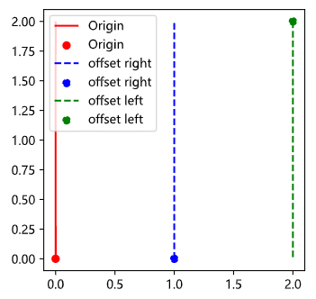

# [shapely](https://shapely.readthedocs.io/en/stable/manual.html)

## 常用函数

- `parallel_offset`
Returns a LineString or MultiLineString geometry at a distance from the object on its right or its left side.


  ``` python
  # parallel_offset(distance, side, resolution=16, join_style=1, mitre_limit=5.0)
  """
  side: Left and right are determined by following the direction of the given geometric points of the LineString. Right hand offsets are returned in the reverse direction of the original LineString or LineRing, while left side offsets flow in the same direction. Vertices of right hand offset lines will be ordered in reverse.
  join_style: is for outside corners between line segments. Accepted integer values are 1 (round), 2 (mitre), and 3 (bevel).
  """
  from shapely.geometry import Point, LineString

  offset_dis = 1
  line = LineString([[0,0], [0, 1], [0, 2]])
  ax = gpd.GeoDataFrame({'geometry': [line, Point(line.coords[0])]}).plot(color='red', label='Origin')

  # 蓝线，然后倒置顺序
  new_line_0 = LineString(line.parallel_offset(offset_dis, side='right').coords[::-1])
  gpd.GeoDataFrame({'geometry': [new_line_0, Point(new_line_0.coords[0])]}).plot(ax=ax, color='blue', linestyle='--', label='offset right')

  new_line_1 = LineString(line.parallel_offset(offset_dis*-1.1, side='left'))
  gpd.GeoDataFrame({'geometry': [new_line_1, Point(new_line_1.coords[0])]}).plot(ax=ax, color='green', linestyle='--', label='offset left')

  ax.legend()

  # Notice: This method may sometimes return a MultiLineString where a simple LineString was expected
  """
  LINESTRING (113.9354422 22.512357, 113.9354434 22.5120418, 113.9354438 22.5118734, 113.9354442 22.5117561)
  LINESTRING (113.9070743 22.5341312, 113.9070738 22.534377, 113.9070732 22.5346515, 113.9070725 22.5349332, 113.9070721 22.5351159)
  LINESTRING (113.9354442 22.5117561, 113.9354438 22.5118734, 113.9354434 22.5120418, 113.9354422 22.512357)
  """
  ```

- `wkt.loads`
  
  ``` python
  from shapely import wkt
  p1 = wkt.loads('POLYGON((0 0, 1 0, 1 1, 0 1, 0 0))')
  ```
