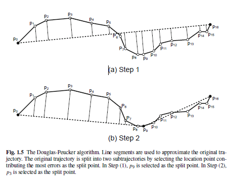

# Computing with Spatial Trajectories

## 1. Trajectory Preprocessing

Chapter 1 first presents data reduction techniques that can run in a batch mode after the data is collected or in an online mode as the data is being collected. The second part of the chapter introduces methods for filtering measurement noise from location trajectories, including mean and median filtering, the Kalman filter, and the particle filter. In short, this chapter provides a newcomer with the fundamentals for preprocessing spatial trajectories.

### 1.3 Performance Metrics and Error Measures

- Processing time
- Compression rate
- Error measure
  - perpendicular Euclidean distance
  - time synchronized Euclidian distance

### 1.4 Batched Compression Techniques

- Douglas-Peucker (DP)
The idea is to replace the original trajectory by an approximate line segment. If the replacement does not meet the specified error requirement, it recursively partitions the original problem into two subproblems by selecting the location point contributing the most errors as the split point. This process continues until the error between the approximated trajectory and the original trajectory is below the specified error threshold. The DP algorithm aims to preserve directional trends in the approximated trajectory using the perpendicular Euclidean distance as the error measure.

- top-down time-ratio (TD-TR)
By propose to adopt a new error metrics, called time-distance ratio metric, to replace the perpendicular Euclidean distance in the Douglas-Peucker algorithm. They claim that the improvement is important because this new error measure is not only more accurate but also taking into consideration both geometric and temporal properties of object movements.

### 1.5 On-Line Data Reduction Techniques

### 1.6 Trajectory Data Reduction Based on Speed and Direction

### 1.7 Trajectory Filtering

## 2. Trajectory Indexing and Retrieval

## 3. Uncertainty in Spatial Trajectories

## 4. Privacy of Spatial Trajectories

## 5. Trajectory Pattern Mining

## 6. Activity Recognition from Trajectory Data

## 7. Trajectory Analysis for Driving

## 8. Location-Based Social Networks: Users

## 9. Location-Based Social Networks: Locations
